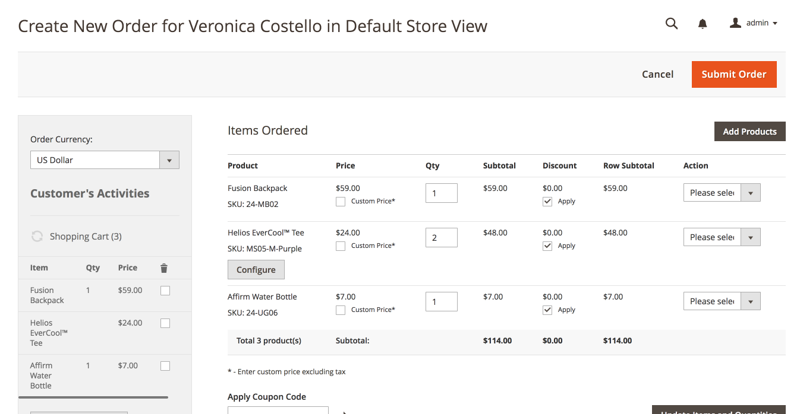

# Shopping Cart Management

## Introduction

There are times that for one reason or another a customer is not able to complete her order and would want an admin to complete the order on behalf of the customer. This extension firstly gives an authorized  admin user, a view of all carts.

Authorized admin users can log into the application, see a list of carts, click to see details and convert to an order any valid cart. For carts that have been converted to an order, the admin user sees a link to view order details.

This extension provides a desirable functionality for Magento 2 community editions.

This documentation provides a guide of how to install and use the extension in your Magento2 store.


## Installation

While you can install directly from within Magento module manager, our recommended approach is using composer.

To use composer:


```composer require digitek/module-shoppingcartmgt```

This updates your composer.json file and pulls in the extension to your vendors/digitek/ folder.

To enable the extension run

```php bin/magento module:enable Digitek\_ShoppingCartMgt```

```php bin/magento setup:upgrade```


## Administration

To access the menu, click on Sales => Shopping Cart.

 


### View All Shopping Carts

A list of carts is displayed, from the most recent to the oldest. Click on &quot;View&quot; to view cart details.


### View Cart Details

The cart details displays all the items in the cart, the cart summary, including subtotal. If the cart has been converted to an order, then it provides a button to display the order details.


### Convert To Cart

If the cart is active, and can be converted to an order, the &quot;Convert to Order&quot; button is displayed.


Clicking the &quot;Convert to Order&quot; button opens up the order form, with the items in cart already pre-populated. Edits can be made before final order creation.



Support
-------
If you have any issues with this extension, open an issue on [GitHub](https://github.com/phronesis/ShoppingCartMgt/issues).

Contribution
------------
Any contribution is highly appreciated. The best way to contribute code is to open a [pull request on GitHub](https://help.github.com/articles/using-pull-requests).

Developer
---------
David Umoh
[http://www.davidumoh.com](http://www.davidumoh.com)
[@umohdave](https://twitter.com/@umohdave)

Licence
-------
[OSL - Open Software Licence 3.0](http://opensource.org/licenses/osl-3.0.php)

Copyright
---------
(c) 2018 David Umoh